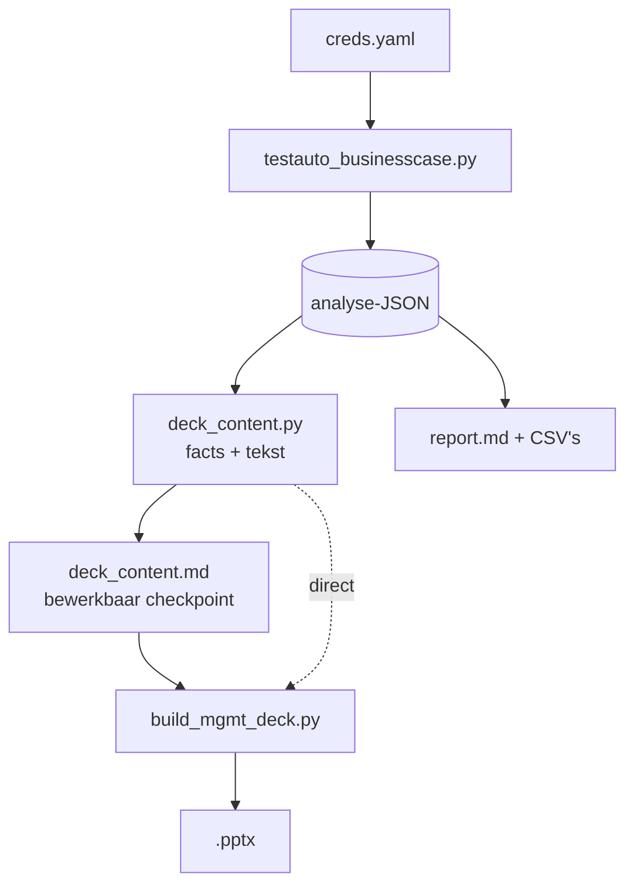
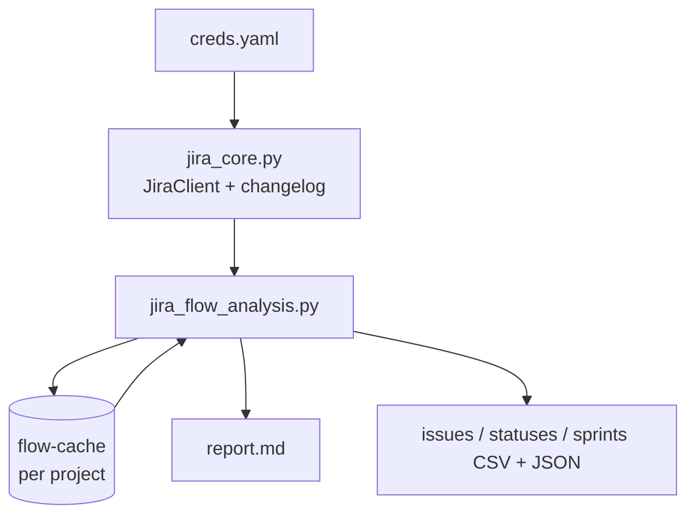

# Technisch ontwerp — wat wordt er opgehaald, geparsed en afgeleid

Dit document beschrijft de volledige keten in volgorde: welke bron wordt bevraagd,
welk veld eruit komt, hoe dat wordt geïnterpreteerd, en welke aannames erin zitten.
Bedoeld om elk getal in het rapport en het deck terug te kunnen voeren op een bron —
of, waar dat niet kan, expliciet te zien dát het een aanname is.

§0 t/m §12 beschrijven de **business case per story** (Jira + TestRail); §13 de
losstaande **flow-analyse per project** (alleen Jira), die de gedeelde laag
`jira_core.py` met de eerste keten deelt.

Twee scripts, één keten:



---

## 0. Configuratie en authenticatie

`_find_creds()` zoekt `creds.yaml` in deze volgorde en pakt de eerste die bestaat:
werkdirectory → naast het script → één map hoger → `~/github_repos/fo_doc_gen/`.
Te overrulen met `--creds`.

| Bron | Auth | Bijzonderheid |
|---|---|---|
| Jira Data Center | `Authorization: Bearer <PAT>` | `verify=False` (self-signed cert) |
| TestRail | Basic auth (e-mail + api_key) | `verify_ssl` uit creds, standaard `False` |

**Jira base-URL.** `creds.yaml` bevat de host zonder servletpad. `JiraClient._resolve_base()`
probeert daarom `GET {root}/rest/api/2/serverInfo` en daarna `{root}/jira/...`, en houdt
de eerste die HTTP 200 geeft. Op deze instantie wint `https://jira.vitens.lan/jira`.
Zonder die probe geeft élke call 404.

**TestRail-paginering.** `get_all()` haalt pagina's van 250 op via `offset`. Twee
vangnetten: deze TestRail-versie negeert `offset` op `get_tests` en geeft eindeloos
dezelfde eerste pagina terug — als het eerste `id` van een pagina gelijk is aan dat van
de vorige, stopt de lus. Daarnaast een harde cap van 40 pagina's.

---

## 1. Koppeling Jira ↔ TestRail (vóór alle analyse)

De hele analyse plakt de Jira-levenscyclus van één story op de uitvoeringsdata van één
run. Zijn die niet gerelateerd, dan is het resultaat nog steeds intern consistent — en
daarmee stilzwijgend fout. Daarom wordt de koppeling eerst uit de data vastgesteld.

1. `GET get_run/{id}` → veld `refs` (gezaghebbend) en `name` (terugval).
2. `_JIRA_KEY_RE` (`[A-Z][A-Z0-9]+-\d+`) haalt de sleutels eruit.
3. `resolve_story_key()`:
   - geen `--jira` → eerste sleutel uit `refs`, anders uit de naam;
   - wél `--jira` en die staat in de lijst → bevestigd;
   - wél `--jira` en die staat er níét in → **afbreken** (tenzij `--allow-unlinked`);
   - niets gevonden en geen `--jira` → afbreken.

Voorbeeld: run 26442 heeft `refs = "S34-2907"`, run 26119 heeft
`refs = "S34-2908,ITS-294576"` (eerste wint, de rest wordt gemeld).

Het resultaat gaat als `source_link` het JSON in, zodat achteraf te zien is waaróp
de koppeling rustte.

---

## 2. Jira-levenscyclus — `build_jira_lifecycle()`

`GET /rest/api/2/issue/{key}?expand=changelog`, plus per subtaak dezelfde call.

| Wat | Hoe geparsed |
|---|---|
| Statusovergangen | `changelog.histories[].items[]` gefilterd op `field == "status"`; per item `fromString`/`toString` + `created` |
| Tijd per status | `_time_in_status()`: verschil tussen opeenvolgende overgangen, opgeteld per statusnaam, in dagen |
| Sprint-spillover | dezelfde `items[]`, `field == "Sprint"` — aantal wisselingen |
| Impediment | `field == "Flagged"` |
| Subtaken | `fields.subtasks[]`, elk apart opgehaald met changelog |

Alles wat later "45 dagen In testing" heet, komt hiervandaan. Er is geen
urenregistratie: `worklogs` is leeg en `timespent` is `null` op de story én alle
subtaken.

---

## 3. TestRail-run — `build_run_metrics()`

Vier calls: `get_run/{id}`, `get_tests/{id}`, `get_results_for_run/{id}`, `get_statuses`.

| Metriek | Afleiding |
|---|---|
| Uitvoeringen per test | `Counter(r["test_id"])` over alle resultaten → gemiddelde/mediaan/max |
| First-pass rate | per test het vroegste resultaat mét status; aandeel daarvan dat `passed` is |
| Statusverdeling | `status_id` → naam via `get_statuses` |
| Testvenster | vroegste en laatste `created_on` over alle resultaten |
| Testdagen | aantal unieke kalenderdagen met een resultaat |
| W-codes | `\bW\d{3}\b` op testtitels; een test die `W010 -> W100` heet telt voor béíde |
| Defects | `result.defects` gesplitst op `[,\s]+` → `issuekey in (...)` naar Jira voor samenvatting + oplostijd |

### De inspanningsproxy (`_session_gap_effort`)

Nergens staan uren. Wat er wél is: elk resultaat draagt `created_on` en `created_by`.
Per tester worden de tijdstempels gesorteerd en de gaten tussen opeenvolgende
inzendingen genomen, **afgekapt op 60 minuten** (`SESSION_GAP_CAP_S`) — een groter gat
is een pauze of een andere dag, geen werk aan één test.

Daaruit volgen: mediaan minuten per uitvoering (de ankerwaarde voor het ROI-model),
netto actieve uren, en per tester het aantal actieve dagen. Dat laatste, gesommeerd
over alle testers, is de **persoonstestdag** — de rekeneenheid van de business case.

> **Dit is een ondergrens.** De methode ziet geen losse resultaten (geen gat om te
> meten), geen voorbereiding, geen analyse van een failure. Run 26442: 7,01 netto
> actieve uren tegenover 26 persoonstestdagen. De waarheid ligt daartussen, en dát
> gat is precies de onzekerheid in de business case.

---

## 4. Corpus / frequentie — `build_corpus()` *(over te slaan met `--skip-corpus`)*

`get_runs/{project}?suite_id=` en dan per run `get_tests`; daarnaast eenmalig
`get_cases`, `get_statuses`, `get_sections` en `get_plans` (alleen een telling — zie
de kanttekening onder §4b). Duurt ~7 minuten over 394 runs; de rest van de analyse
werkt ook zonder.

**Cache — waarom, stap voor stap.** (1) De 7 minuten zitten volledig in de
per-run `get_tests`-lus; de losse metadata-calls zijn verwaarloosbaar. (2)
Diezelfde opgehaalde testdata beantwoordt méér dan één vraag — frequentie,
de-facto regressie (§4b), testfase-provenance (§6) — maar werd vroeger na het
tellen weggegooid, zodat elke nieuwe vraag een nieuwe scan van 7 minuten kostte.
(3) Door de ruwe fetch te cachen scheiden we *meten* van *interpreteren*:
`fetch_corpus_raw()` haalt op (bewaart per test `case_id`/`title`/`status_id`/
`refs`), `_analyse_corpus()` rekent puur (geen API) — dus een nieuwe drempel of
classifier her-analyseren is offline, reproduceerbaar en gratis. (4) De cache
wordt gevalideerd op `CORPUS_CACHE_VERSION` + project + suite, en geweigerd als
hij op `--max-runs` gecapt was terwijl een run méér wil — zo analyseer je nooit
per ongeluk de verkeerde suite. Bestand:
`output/corpus_cache_p<project>_s<suite>.json`; `--refresh-corpus` forceert een
verse scan, `--corpus-cache PATH` wijst een ander bestand aan, ouder dan ~7 dagen
geeft een waarschuwing. De 7-minuten-scan betaal je dus één keer per verversing.

**Uitgevoerd, niet gepland.** `status_id == 3` is TestRail's `untested`: de test is
aangemaakt maar nooit gedraaid. Alles wordt geteld als `status_id != 3`. Dit is geen
detail — drie runs van 2.868 tests (21617/16748/15261) staan voor 100% op untested.
Telden die mee, dan kwam het jaarvolume op 9.203 uitvoeringen in plaats van 2.227,
en werd de ROI ruim vier keer te rooskleurig.

**Regressie-herkenning.** `_REGRESSION_TITLE_RE` = `regress|W\d{3}\s*->\s*W\d{3}`,
toegepast op testtitels. Een run telt als regressie zodra hij minstens één zo'n test
bevat. Ook per testgeval in de suite (`get_cases`) → `cases_regression_titled` (80).

**Automatiseringsgraad.** `custom_automation_type == 1` (Ranorex) over alle cases:
1 van 2.868.

### 4b. De-facto regressie — `build_defacto_regression()`

**Waarom dit nodig is, en wat het aan nauwkeurigheid verandert.** De getitelde
telling (4/4/17/37 uitgevoerde regressietests per jaar) meet *naamgeving*, niet
*gedrag* — en onderschat daarmee de werkelijke regressiepraktijk. Op zichzelf zou
die telling een verkeerde conclusie steunen ("er bestaat vrijwel geen
regressiepraktijk"). De pass→rerun-detectie meet gedrag en corrigeert dat: bij
het incassoproces blijken 128 cases de-facto regressiegedrag te vertonen tegen 80
getitelde, met een overlap van 1 — de gelabelde en de feitelijke set zijn vrijwel
disjunct. Effect op de analyse: het ROI-model krijgt een derde, gedragsgebaseerde
scope (~115 exec/jaar naast de ~71 getitelde), en de bevinding "overlap 1 van 80"
maakt zichtbaar dat de gelabelde telling het verhaal niet mag dragen. Het blijft
een **ondergrens** (plan-runs onzichtbaar, in-run hertests samengevouwen — zie
onder). Zie ook de Begrippen-sectie in het rapport (ISTQB `regression testing`):
de-facto regressie is gedragsmatig exact die definitie, alleen zonder het label.

Mechanisch — de detectie leest gedrag i.p.v. naamgeving, uit de gecachte
case-level corpus (zelfde API-calls, geen extra kosten):

1. Runs op `(created_on, id)` geordend; per `case_id` de lijst uitgevoerde
   verschijningen over runs (`status_id != 3`).
2. Per verschijning ná de eerste: was de laatst bekende uitkomst **passed**, dan is
   het een **pass→rerun** (iets dat al werkte opnieuw draaien = verificatie na
   wijziging — regressiegedrag). Na fail/retest/blocked telt het als defect-gedreven
   hertest. Custom statussen komen in `unknown_status_executions`, nooit stilzwijgend
   in een van beide bakken.
3. **De-facto regressiecase** = ≥1 pass→rerun. Daarnaast als corroboratie:
   `cases_recurrent` (uitgevoerd in ≥`--recurrence-min` runs, default 3), distinct
   milestones en distinct Jira-refs per case (dezelfde test onder verschillende
   stories hergebruikt is zelf een regressiesignaal).

Uitvoer: `corpus.defacto_regression` (tellingen, per-jaar pass→rerun/hertest-reeksen,
top-20 + volledige caselijst) → rapport §5b, kolommen in §5 en §7, CSV
`_defacto_regression.csv`, en ROI-scope `defacto_regression` (§8). In het rapport is
de business-implicatie bewust een **scenario, geen claim**.

Twee precisiegrenzen, in het rapport zelf ook genoemd: `get_tests` levert per run
alleen de **eindstatus** (een in-run fail→pass leest als "passed" — de classificatie
gebruikt de laatst bekende uitkomst, wat precies is wat de volgende run zag), en
`get_runs` toont **geen runs bínnen testplannen** — vandaar de `get_plans`-telling;
het de-facto volume is een ondergrens.

---

## 5. Wijzigingsdruk per processtap — `build_change_pressure()`

Bouwt eerst een inventaris van W-stappen uit alle testtitels in de suite, en zoekt
dan in Jira: `project in (S34, KFDO) AND (summary ~ "W010" OR summary ~ "W020" …)`,
maximaal 200 issues.

Per stap: aantal issues, gesplitst in stories vs bugs (`"bug" in issuetype.lower()`),
per jaar, met drie voorbeelden. Plus `steps_missing_from_case_study_run`: stappen die
wél in de suite zitten maar niet in de bestudeerde run — voor run 26442 zijn dat
W050, W070, W080, W085 en W090.

> **Bekende inconsistentie.** `build_run_metrics` matcht `\bW\d{3}\b` (exact drie
> cijfers), terwijl corpus en wijzigingsdruk `\bW\d{2,3}\b` matchen en daarna
> normaliseren (`W70` → `W070`). Een testtitel met `W70` telt dus wél mee in de
> inventaris maar niet in de per-run-verdeling.

---

## 6. Dev vs test — `build_dev_test_ratio()`

Kalenderproxy, geen uren: dagen in `In Progress` (dev) tegenover dagen in
`In testing` (test), uit dezelfde changelog als §2. Toegepast op de story zelf, op
elke gevonden bug, en op alle kinderen van de epic (`"Epic Link" = <KEY>`).

Drie correcties die het cijfer bruikbaar maken:

- **Teruggeboekte statussen.** Staan álle transities van een issue binnen ~1 uur
  (`_BACKFILL_THRESHOLD_D = 0.04`), dan is de status administratief achteraf gezet en
  zegt de doorlooptijd niets. Zulke issues worden gemarkeerd en uitgesloten.
- **Alleen waar beide fasen gemeten zijn.** De geaggregeerde ratio telt alleen issues
  met >0,1 dag in beide fasen.
- **Ontbrekende testfase apart gemeld.** Een afgeronde story die nooit `In testing`
  is geweest, gaat niet als "0 testtijd" mee maar wordt geteld in
  `n_resolved_without_testing_phase` — bij S34-2907 waren dat er 5, waaronder de
  W010-story. De werkelijke test:dev-verhouding ligt dus hóger dan de gemeten 1,33.

**Testfase-provenance (met corpus) — wat het is en waarom het telt.**
"Provenance" = *welk systeem het testen heeft geregistreerd*. Het probleem: vijf
afgeronde stories hebben nul dagen Jira-teststatus; zónder provenance lezen die
als "niet getest", wat de test:dev-ratio en het datakwaliteitsbeeld van §8
vertekent. De oplossing: het corpus levert `run_jira_keys` (per Jira-key de
TestRail-runs die hem in `refs`/naam noemen), en elk issue krijgt een label
`test_provenance` — `jira_status` (>0,1 d In testing) · `testrail_inferred` (geen
Jira-teststatus, wél runs op de key — met `testrail_runs` en een kalendervenster
`testrail_window_days` uit run-datums) · `none`. Het `testrail_inferred`-label
bewíjst dat er getest is (er verwijzen runs naar de story), ook al legde Jira het
niet vast — dus "geen status" ≠ "niet getest", en het rapport kan het aandeel
noemen in plaats van te gissen. De afgeleide vensters tellen **niet** mee in de
ratio zelf (die blijft een zuivere Jira-meting). Split in
`ratio_summary.test_provenance_split`, rapport §8, kolommen in `_devtest.csv`.

**Hertest-wachttijd.** Per resultaat met een defect wordt vooruit gezocht naar het
eerstvolgende resultaat op dezelfde test met `status_id == 1` (passed); het verschil
is de hertest-gap. Mediaan bij run 26442: 7,9 dagen.

---

## 7. Waardestroom — `build_value_stream()`

SAFe-stijl value stream map: per stap actieve tijd, wachttijd en %C&A, alles in
**werkdagen** (`_workdays`, ma–vr). Scope bewust `start bouw → opgeleverd`; de
backlog-wachttijd (187 werkdagen) wordt apart gerapporteerd omdat hij anders alles
overheerst.

| Stap | Actief | Wacht |
|---|---|---|
| Bouw | venster × 0,8 FTE | rest van het venster |
| Testvoorbereiding | heuristiek (zie hieronder) | rest tot eerste resultaat |
| Testuitvoering | persoonstestdagen (§3) | werkdagen binnen het venster zonder één resultaat |
| Bugfix + hertest | aantal hertests × 0,5 d | mediane hertest-gap (§6) |
| Afronding | 1,0 dag | laatste resultaat → story Resolved |

Het geautomatiseerde scenario laat de stappen staan maar zet testuitvoering op
1 actieve dag (draaien is automatisch; beoordelen blijft) en de hertest-wachttijd op
1 dag.

> **De stapaannames staan centraal in `STEP_ASSUMPTIONS`** (`prep_active_fraction`
> 0,20 · `prep_fallback_days` 3,0 · `bugfix_active_days_per_retest` 0,5 ·
> `closure_active_days` 1,0), naast `FTE_FACTOR` 0,8 voor de bouw. Elke stap draagt
> een **`basis`-label** — `gemeten` (testuitvoering, uit result-timestamps),
> `afgeleid` (gemeten venster × aanname) of `aanname:<sleutel>` — dat in rapport
> §6b als kolom "Basis" verschijnt. De prep-schatting gebruikt het gemeten
> subtaakvenster (titels met `voorbereid`/`bestaalstapel`/`testdata`) waar dat
> bestaat en valt anders terug op de vaste 3,0 dagen; welk pad gold, staat in het
> label. Heuristiek blijft heuristiek — maar nu per regel zichtbaar.

---

## 8. ROI-model — `build_roi_model()`

Anker: de gepoolde mediaan van de sessiegaten uit §3 (8,3 min voor run 26442).
Bandbreedte daaromheen: ×0,75 / ×1,5 / ×2,0 — **gevoeligheidsanalyse, geen meting**,
bedoeld om de denk- en opstarttijd te dekken die de gatenmethode niet ziet.

Vaste modelparameters, elk met zijn **basis** (industriereferentie / lokale
inschatting die de pilot vervangt / organisatieconventie) — voluit in rapport
§11.5, hier samengevat:

| Parameter | Waarde | Basis |
|---|---|---|
| Bouwinspanning per testgeval | 2 / 4 / 8 uur | lokale inschatting (→ pilot) |
| Onderhoud per jaar | 20% van de bouwinspanning | industrie: 10–30% gangbaar |
| Restinspanning na automatisering | 10% (triage, supervisie) | lokale inschatting |
| Minuten/executie-banden | anker ×0,75 / ×1,5 / ×2,0 | lokale gevoeligheidsband |
| Actieve bouwtijd | 0,8 FTE | organisatieconventie |

De meeste parameters zijn géén industrienorm; het rapport zegt dat expliciet in
plaats van autoriteit te suggereren.

Drie scopes worden doorgerekend — `regression_subset`, `whole_suite` en (wanneer de
de-facto-analyse van §4b beschikbaar is) `defacto_regression`, gevoed door de
pass→rerun-executies per jaar — omdat de regressie-subset alléén te dun is om op te
bouwen. De de-facto-scope is nadrukkelijk een scenario: hij kwantificeert wat er te
winnen valt áls de ongelabelde her-uitvoeringen inderdaad verificatiewerk waren.
Het lopende jaar wordt geannualiseerd op basis van de dagen die verstreken zijn.

Daarnaast `target_cadence_scenarios`: wekelijks (52×) en per sprint (17×), met één
uitvoering per testgeval per ronde. Dit is het beslissende scenario — bij de
historische cadans (4/4/17/37 per jaar) verdient automatisering zich nooit terug.

---

## 9. Rapport en artefacten — `render_report_md()` / `write_outputs()`

Acht bestanden per run: JSON + `report.md` + CSV's voor runs, defects, timeline,
W-stappen, dev:test en (met corpus) de-facto-regressiecases
(`_defacto_regression.csv`, één rij per case met pass→rerun-gedrag).

`§0 "De kern"` leidt alles af uit de meting — persoonstestdagen, testvenster (onder
twee weken in werkdagen, daarboven in weken), stilstand, doorlooptijd, bouwdagen uit
`cases × urenband`. Ook het oordeel volgt de meting: past een ronde binnen een week,
dan is het antwoord op "kan dat handmatig?" niet automatisch "nee".

Wat er niet uit volgt — bespaarde testdagen per ronde, aantal rondes tot
terugverdiend — is uit §0 verwijderd en verwijst naar §5.

---

## 10. Deck — `deck_content.py` → `build_mgmt_deck.py`

Ontstaan uit een concreet defect: de dektekst stond hard in de renderer. Bij het
renderen van een andere run bleven de oude getallen staan, waardoor het deck
zelfverzekerd cijfers toonde die nergens uit volgden.

```
analyse-JSON → facts()          alle getallen, afgeleid
             → default_content() alle tekst, f-strings over facts
             → to_md()           bewerkbaar checkpoint (--emit-content)
             → parse_md()        terug inlezen (--content)
             → build()           alleen nog vorm: vlakken, tabellen, KPI-kaarten
```

Zonder `--content` wordt de tekst direct uit de JSON afgeleid; beide paden geven een
identiek deck. Het checkpointformaat is bewust simpel: `## sleutel` gevolgd door de
tekst. Opsommingen zijn markdown (`- **vet**` = niveau 0 vet, ingesprongen `- ` =
niveau 1), tabelrijen zijn pipe-gescheiden.

`facts()` past de formulering aan de meting aan: onder twee weken telt het deck in
werkdagen in plaats van "0 weken", de zin over de werkverdeling verschilt bij 1, 2 of
3+ testers, en zonder corpus staat er "zonder historie-scan" in plaats van "0 jaar
testhistorie".

---

## 11. Gemeten versus aangenomen

De belangrijkste tabel in dit document.

| Grootheid | Status | Bron of aanname |
|---|---|---|
| Statusovergangen, tijd per status | **gemeten** | Jira changelog |
| Uitvoeringen, first-pass, testvenster, testdagen | **gemeten** | TestRail resultaten |
| Defects en oplostijd | **gemeten** | `result.defects` → Jira |
| Runs/jaar, uitgevoerde tests/jaar, automatiseringsgraad | **gemeten** | TestRail corpus |
| De-facto regressiecases, pass→rerun-executies | **afgeleid** | cross-run eindstatussen (§4b); ondergrens door onzichtbare plan-runs |
| Testfase-provenance (jira_status / testrail_inferred / none) | **afgeleid** | Jira-status + `run_jira_keys` uit run-refs (§6) |
| Wijzigingsdruk per W-stap | **gemeten** | Jira JQL op `summary` |
| Netto actieve uren | **ondergrens** | sessiegaten ≤ 60 min |
| Minuten per uitvoering (banden) | **aanname** | anker ×0,75 / ×1,5 / ×2,0 |
| Bouwinspanning per testgeval | **aanname** | 2/4/8 uur, geen pilotdata |
| Onderhoud 20%/jaar, restinspanning 10% | **aanname** | modelparameters |
| Actieve bouwtijd (0,8 FTE) | **aanname** | geen registratie |
| Waardestroom-stappen prep/bugfix/afronding | **aanname/heuristiek** | `STEP_ASSUMPTIONS`; per stap gelabeld in §6b (kolom Basis) |
| Testerrol (systeemtester) | **aanname** | `get_users` 403; BAT valt buiten TestRail-data |
| Bespaarde testdagen per ronde (±13), rondes tot terugverdiend (±5) | **aanname** | `deck_content.ASSUMPTIONS`, herkomst niet te reconstrueren |

---

## 12. Bekende beperkingen

1. **Uren bestaan niet in de bron.** Nul worklogs, nul schattingen, TestRail `elapsed`
   gevuld op 1 van de 108 resultaten. Alles wat op uren lijkt is afgeleid of aangenomen.
2. **De waardestroom hangt aan statusnamen.** `In Progress` en `In testing` zijn
   hardcoded. Een workflow zonder die statussen levert een lege of misleidende
   waardestroom (zichtbaar bij KFDO-1024).
3. **W-codeherkenning is incasso-specifiek**, en de regex verschilt tussen modules
   (zie §5).
4. **Testerrollen zijn een aanname.** `get_users` geeft 403, dus rollen zijn niet uit
   de data af te leiden. Werk-aanname: alle TestRail-testers zijn **systeemtesters**;
   business-acceptatietests (BAT/key-usertests) zitten níet in de TestRail-data en
   vallen buiten elke meting in deze analyse.
5. **Runs worden zelden afgesloten.** 96% van de runs heeft geen `completed_on`, dus
   "open → gesloten" is als doorlooptijdmaat onbruikbaar; vandaar eerste → laatste
   resultaat.
6. **Eén gemeten ronde.** Run 26119 bleek geen vergelijkbare ronde (2 persoonstestdagen,
   1 tester, geen hertests) maar een wijzigingstest. De volledige procesregressie is
   feitelijk één keer gedraaid — wat de enabler-redenering versterkt, maar betekent dat
   er geen tweede meetpunt is.
7. **Runs bínnen testplannen zijn onzichtbaar.** `get_runs` toont ze niet; ze worden
   alleen geteld via `get_plans`. Corpus- en de-facto-volumes zijn daardoor
   ondergrenzen.
8. **Eindstatus per run.** `get_tests` kent geen resultaathistorie; een in-run
   fail→pass leest als "passed". De de-facto-classificatie gebruikt daarom de laatst
   bekende uitkomst — precies wat de eerstvolgende run zag — maar in-run hertests
   blijven er onzichtbaar (die meet §3 alleen voor de case-study-run).

---

## 13. Flow-analyse per project — `jira_flow_analysis.py`

Een tweede, zelfstandige keten: niet één story maar een **heel Jira-project**, en
niet de business case maar de **doorlooptijd per statuscategorie** — de vraag
achter een cumulative flow diagram. Read-only, uitsluitend Jira, geen TestRail.



`scripts/jira_core.py` is de gedeelde laag onder béide scripts: `_find_creds`,
`JiraClient` (Bearer PAT + contextpad-probe), `_status_transitions`,
`_status_spans`, `_time_in_status*`, `_workdays*`, `_md_table`, `_write_csv`.
`testauto_businesscase.py` importeert er nu uit in plaats van eigen kopieën te
houden.

### 13.1 Ophalen

| Stap | Call | Bijzonderheid |
|---|---|---|
| Projectsleutel | — | `_project_key()` accepteert `…/browse/MOD`, `…/browse/MOD-123`, `…/projects/MOD` of `MOD` |
| Statuscategorieën | `GET /rest/api/2/project/<KEY>/statuses` | levert per issuetype de statussen mét `statusCategory` |
| Sprintveld | `GET /rest/api/2/field` | het customfield met `schema.custom` ~ `gh-sprint` (op MOD: `customfield_10007`) |
| Issues | `GET /rest/api/2/search` + `expand=changelog` | via `JiraClient.search_all()` — **met `startAt`-paginering** |

`search_all()` bestaat omdat de bestaande `search()` één request doet en alles
boven `maxResults` stil laat vallen; voor een projectbrede analyse is dat het
verschil tussen "de eerste 100 issues" en "het project".

JQL: `project = "<KEY>" AND (resolutiondate >= <start> OR (resolutiondate IS
EMPTY AND updated >= <start>))`, standaard `AND issuetype NOT IN
subTaskIssueTypes()`. Open issues worden dus meegenomen (als WIP), maar alleen
als ze recent zijn aangeraakt.

De opgehaalde issues gaan in `output/<PROJECT>/jira_flow_cache_<PROJECT>.json`
met een fingerprint (`project`, `months`, `jql`) plus `cache_version` — wijkt er
iets af, of staat `--refresh` aan, dan volgt een verse fetch. Zelfde patroon als
de corpus-cache in §4.

### 13.2 Statuscategorieën en normalisatie

De changelog levert alleen status**namen** (`fromString`/`toString`), geen
categorie; die komt uit de workflow (`statusCategory.key`: `new` → To Do,
`indeterminate` → In Progress, `done` → Done). Dit script kent daarmee géén
hardgecodeerde statusnamen — de beperking uit §12.2 geldt hier niet.

**Hoofdlettergevoeligheid is een echte valkuil.** De changelog bewaart de naam
zoals die op dát moment was, en dat verschilt in de praktijk soms alleen in
casing: op MOD komen `in Review` en `In Review` in hetzelfde issue voor.
`canonical_statuses()` mapt via een kleine-letterindex terug naar de huidige
schrijfwijze. Zonder die stap valt één status uiteen in twee rijen, waarvan er
één als *onbekend* wordt geteld — bij MOD scheelde dat 12 van de 15 metingen op
`In Review`. Statussen die ook case-insensitief niet in de workflow zitten
(echt hernoemd of verwijderd) worden als `onbekend` geteld én in rapport §1
opgesomd, niet stil in een categorie geduwd.

### 13.3 Tijd per status — werkdagen

`_status_spans()` (gedeeld) levert per aaneengesloten verblijf `(status, start,
eind)`. `_time_in_status_workdays()` telt die op met `_workdays_elapsed()`.

Let op het verschil met de bestaande `_workdays()` uit §7: die telt de **startdag
altijd als hele dag** — een fase-lengte, geen duur. Voor statusverblijven is dat
onbruikbaar (een status van tien minuten zou 1 dag scoren), dus meet
`_workdays_elapsed()` de écht verstreken tijd met de weekenden eruit; een deel
van een dag telt naar rato van het etmaal. Er is nergens urenregistratie, dus
een kantoorurenvenster (09–17) zou een precisie suggereren die de data niet
heeft. `_workdays()` is ongewijzigd gebleven zodat de waardestroom in §7
identiek blijft rekenen.

**Het observatievenster per issue** (`_observation_end`) eindigt bij de láátste
statusovergang als het issue in een Done-status staat — "al 200 dagen Closed" is
archieftijd, geen doorlooptijd. Gevolg: in een workflow met één Done-status is
de categorie *Done* (bijna) nul. Dat is de juiste lezing, en staat als zodanig in
rapport §5. Loopt het issue nog, dan telt de tijd door tot nu, maar het valt dan
buiten de aggregaten (zie 13.5).

### 13.4 Sprints en venstersnapping

Sprintwaarden komen uit het customfield en zijn óf greenhopper-strings
(`…Sprint@1f39bc[id=…,state=CLOSED,name=…,startDate=…,completeDate=…]`) óf, op
nieuwere DC-versies, JSON-objecten; `_parse_sprint_value()` kan beide, inclusief
namen met komma's erin en `completeDate=<null>`. Het sprinteinde is
`completeDate` als die er is, anders `endDate` — de feitelijke afsluiting gaat
vóór de planning.

- **Snapping** (`snap_window`): het ruwe venster is `[nu − N maanden, nu]`.
  Meegenomen worden alleen sprints die **afgerond** zijn én volledig binnen dat
  venster vallen; het effectieve venster wordt `[eerste sprintstart, laatste
  sprinteind]`. De reden is rechtse censurering: in een sprint die aan het eind
  van het venster wordt afgekapt tellen alleen de issues mee die er vóór de knip
  al klaar waren, terwijl het tragere werk uit diezelfde sprint erna afrondt en
  buiten beeld valt — die randperiode meet dus systematisch te kort. Beide
  vensters staan in rapport §1. Uit te zetten met `--no-sprint-snap`; zonder sprintveld
  of zonder passende sprints valt het script automatisch terug op het
  kalendervenster, mét waarschuwing.
- **Toewijzing** (`sprint_periods`): sprints overlappen elkaar in de praktijk
  (op MOD loopt "Hemelvaart" t/m 25-06 terwijl de volgende op 19-06 start) en
  laten soms gaten vallen. De perioden worden daarom aaneengesloten gemaakt —
  sprint *i* loopt tot de start van sprint *i+1* — zodat elke afronddatum bij
  precies één sprint hoort. De sprinttabel toont die toewijzingsgrenzen, niet de
  sprintdatums.
- Een issue telt bij de sprint waarin het is **afgerond**, niet die waarin het
  gepland stond. **Spillover** is het aantal `Sprint`-veldwijzigingen in de
  changelog: meer dan één betekent dat het issue tijdens zijn leven van sprint
  is gewisseld.

### 13.5 Aggregatie

Uitgesloten uit de doorlooptijdcijfers, elk apart geteld in rapport §1:

1. **Backfill** — `_is_backfilled()` (gedeeld met §6): alle statusovergangen
   binnen ~1 uur. Op MOD 7 van de 34 afgeronde issues.
2. **Onderhanden werk** — geen `resolutiondate`, dus geen doorlooptijd. Wel
   geteld en per categorie uitgesplitst, want juist daar hoopt het werk zich op.

Per categorie, per status en per sprint: **n / mediaan / gemiddelde / p85**, in
werkdagen. De mediaan is de kop omdat doorlooptijden scheef verdeeld zijn — een
handvol issues blijft maanden liggen, en een kaal gemiddelde beschrijft dan
niemand. `_p85()` interpoleert lineair (geen numpy).

De statusdrill-down toont per status ook `× eindstatus`: hoe vaak die status de
laatste was. Een puur terminale status heeft per definitie geen verblijfsduur en
zou anders helemaal uit de tabel vallen, terwijl juist de vraag "waar eindigt
het werk?" hem nodig heeft.

**Trend per sprint**: de reeks sprintmedianen per categorie, met een
kleinste-kwadratenfit over de sprintindex (helling in werkdagen per sprint,
richting stabiel/stijgend/dalend bij een drempel van 0,05) en een sparkline van
blokjes. Die schaalt per rij tussen het eigen minimum en maximum: hij toont de
vórm van het verloop, niet het niveau. Minder dan 3 sprints met data ⇒ geen
trend.

### 13.6 Gemeten versus afgeleid

| Grootheid | Status | Bron / aanname |
|---|---|---|
| Statusovergangen en tijdstempels | **gemeten** | `changelog.histories` |
| Statuscategorie per status | **gemeten** | `statusCategory` uit de projectworkflow |
| Sprintnaam, start, eind | **gemeten** | sprint-customfield |
| Tijd per status in werkdagen | **afgeleid** | `_workdays_elapsed`; weekenden eruit, deeldag naar rato van het etmaal |
| Einde van het observatievenster | **afgeleid** | laatste overgang bij een Done-status; anders `resolutiondate`, anders nu |
| Sprint van een issue | **afgeleid** | afronddatum binnen de aaneengesloten sprintperiode |
| Spillover | **afgeleid** | >1 `Sprint`-wijziging in de changelog |
| Backfilldrempel (~1 uur) | **aanname** | `BACKFILL_THRESHOLD_D`, gedeeld met §6 |
| "In Progress" = eraan gewerkt | **aanname** | er zijn geen uren; de status zegt alleen dat het issue die status droeg |

### 13.7 Bekende beperkingen

1. **Tijd in de eindstatus telt niet mee** (13.3) — in een workflow met één
   Done-status is *Done* daarom bijna nul.
2. **Hernoemde statussen** vallen buiten de workflow-kaart; casing wordt
   opgevangen (13.2), een echte hernoeming niet.
3. **Onderhanden werk ontbreekt in de gemiddelden.** Loopt het werk júist nu
   vast, dan zie je dat pas als het afrondt; de WIP-verdeling is de tegenhanger.
4. **Sprinttoewijzing gaat op afronddatum**, niet op sprintlidmaatschap — dat is
   robuust tegen slechte sprintveld-hygiëne, maar leest anders dan een
   sprint-burndown.
5. **Geen CFD-grafiek.** De gestapelde vlakdiagram-vorm zelf is bewust niet
   gebouwd (geen plot-dependency); de dagelijkse reconstructie die daarvoor
   nodig is, is met `_status_spans()` wel afleidbaar uit dezelfde data.
