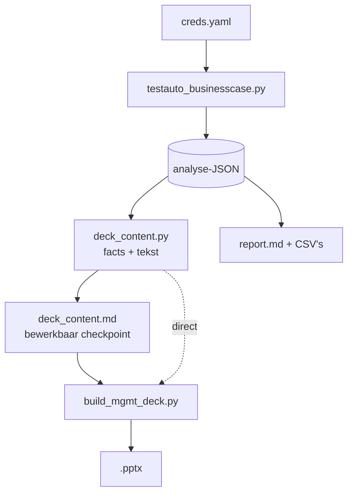

# Technisch ontwerp — wat wordt er opgehaald, geparsed en afgeleid

Dit document beschrijft de volledige keten in volgorde: welke bron wordt bevraagd,
welk veld eruit komt, hoe dat wordt geïnterpreteerd, en welke aannames erin zitten.
Bedoeld om elk getal in het rapport en het deck terug te kunnen voeren op een bron —
of, waar dat niet kan, expliciet te zien dát het een aanname is.

Twee scripts, één keten:



---

## 0. Configuratie en authenticatie

`_find_creds()` zoekt `creds.yaml` in deze volgorde en pakt de eerste die bestaat:
werkdirectory → naast het script → één map hoger → `~/github_repos/fo_doc_gen/`.
Te overrulen met `--creds`.

| Bron | Auth | Bijzonderheid |
|---|---|---|
| Jira Data Center | `Authorization: Bearer <PAT>` | `verify=False` (self-signed cert) |
| TestRail | Basic auth (e-mail + api_key) | `verify_ssl` uit creds, standaard `False` |

**Jira base-URL.** `creds.yaml` bevat de host zonder servletpad. `JiraClient._resolve_base()`
probeert daarom `GET {root}/rest/api/2/serverInfo` en daarna `{root}/jira/...`, en houdt
de eerste die HTTP 200 geeft. Op deze instantie wint `https://jira.vitens.lan/jira`.
Zonder die probe geeft élke call 404.

**TestRail-paginering.** `get_all()` haalt pagina's van 250 op via `offset`. Twee
vangnetten: deze TestRail-versie negeert `offset` op `get_tests` en geeft eindeloos
dezelfde eerste pagina terug — als het eerste `id` van een pagina gelijk is aan dat van
de vorige, stopt de lus. Daarnaast een harde cap van 40 pagina's.

---

## 1. Koppeling Jira ↔ TestRail (vóór alle analyse)

De hele analyse plakt de Jira-levenscyclus van één story op de uitvoeringsdata van één
run. Zijn die niet gerelateerd, dan is het resultaat nog steeds intern consistent — en
daarmee stilzwijgend fout. Daarom wordt de koppeling eerst uit de data vastgesteld.

1. `GET get_run/{id}` → veld `refs` (gezaghebbend) en `name` (terugval).
2. `_JIRA_KEY_RE` (`[A-Z][A-Z0-9]+-\d+`) haalt de sleutels eruit.
3. `resolve_story_key()`:
   - geen `--jira` → eerste sleutel uit `refs`, anders uit de naam;
   - wél `--jira` en die staat in de lijst → bevestigd;
   - wél `--jira` en die staat er níét in → **afbreken** (tenzij `--allow-unlinked`);
   - niets gevonden en geen `--jira` → afbreken.

Voorbeeld: run 26442 heeft `refs = "S34-2907"`, run 26119 heeft
`refs = "S34-2908,ITS-294576"` (eerste wint, de rest wordt gemeld).

Het resultaat gaat als `source_link` het JSON in, zodat achteraf te zien is waaróp
de koppeling rustte.

---

## 2. Jira-levenscyclus — `build_jira_lifecycle()`

`GET /rest/api/2/issue/{key}?expand=changelog`, plus per subtaak dezelfde call.

| Wat | Hoe geparsed |
|---|---|
| Statusovergangen | `changelog.histories[].items[]` gefilterd op `field == "status"`; per item `fromString`/`toString` + `created` |
| Tijd per status | `_time_in_status()`: verschil tussen opeenvolgende overgangen, opgeteld per statusnaam, in dagen |
| Sprint-spillover | dezelfde `items[]`, `field == "Sprint"` — aantal wisselingen |
| Impediment | `field == "Flagged"` |
| Subtaken | `fields.subtasks[]`, elk apart opgehaald met changelog |

Alles wat later "45 dagen In testing" heet, komt hiervandaan. Er is geen
urenregistratie: `worklogs` is leeg en `timespent` is `null` op de story én alle
subtaken.

---

## 3. TestRail-run — `build_run_metrics()`

Vier calls: `get_run/{id}`, `get_tests/{id}`, `get_results_for_run/{id}`, `get_statuses`.

| Metriek | Afleiding |
|---|---|
| Uitvoeringen per test | `Counter(r["test_id"])` over alle resultaten → gemiddelde/mediaan/max |
| First-pass rate | per test het vroegste resultaat mét status; aandeel daarvan dat `passed` is |
| Statusverdeling | `status_id` → naam via `get_statuses` |
| Testvenster | vroegste en laatste `created_on` over alle resultaten |
| Testdagen | aantal unieke kalenderdagen met een resultaat |
| W-codes | `\bW\d{3}\b` op testtitels; een test die `W010 -> W100` heet telt voor béíde |
| Defects | `result.defects` gesplitst op `[,\s]+` → `issuekey in (...)` naar Jira voor samenvatting + oplostijd |

### De inspanningsproxy (`_session_gap_effort`)

Nergens staan uren. Wat er wél is: elk resultaat draagt `created_on` en `created_by`.
Per tester worden de tijdstempels gesorteerd en de gaten tussen opeenvolgende
inzendingen genomen, **afgekapt op 60 minuten** (`SESSION_GAP_CAP_S`) — een groter gat
is een pauze of een andere dag, geen werk aan één test.

Daaruit volgen: mediaan minuten per uitvoering (de ankerwaarde voor het ROI-model),
netto actieve uren, en per tester het aantal actieve dagen. Dat laatste, gesommeerd
over alle testers, is de **persoonstestdag** — de rekeneenheid van de business case.

> **Dit is een ondergrens.** De methode ziet geen losse resultaten (geen gat om te
> meten), geen voorbereiding, geen analyse van een failure. Run 26442: 7,01 netto
> actieve uren tegenover 26 persoonstestdagen. De waarheid ligt daartussen, en dát
> gat is precies de onzekerheid in de business case.

---

## 4. Corpus / frequentie — `build_corpus()` *(over te slaan met `--skip-corpus`)*

`get_runs/{project}?suite_id=` en dan per run `get_tests`. Duurt ~7 minuten over
394 runs; de rest van de analyse werkt ook zonder.

**Uitgevoerd, niet gepland.** `status_id == 3` is TestRail's `untested`: de test is
aangemaakt maar nooit gedraaid. Alles wordt geteld als `status_id != 3`. Dit is geen
detail — drie runs van 2.868 tests (21617/16748/15261) staan voor 100% op untested.
Telden die mee, dan kwam het jaarvolume op 9.203 uitvoeringen in plaats van 2.227,
en werd de ROI ruim vier keer te rooskleurig.

**Regressie-herkenning.** `_REGRESSION_TITLE_RE` = `regress|W\d{3}\s*->\s*W\d{3}`,
toegepast op testtitels. Een run telt als regressie zodra hij minstens één zo'n test
bevat. Ook per testgeval in de suite (`get_cases`) → `cases_regression_titled` (80).

**Automatiseringsgraad.** `custom_automation_type == 1` (Ranorex) over alle cases:
1 van 2.868.

---

## 5. Wijzigingsdruk per processtap — `build_change_pressure()`

Bouwt eerst een inventaris van W-stappen uit alle testtitels in de suite, en zoekt
dan in Jira: `project in (S34, KFDO) AND (summary ~ "W010" OR summary ~ "W020" …)`,
maximaal 200 issues.

Per stap: aantal issues, gesplitst in stories vs bugs (`"bug" in issuetype.lower()`),
per jaar, met drie voorbeelden. Plus `steps_missing_from_case_study_run`: stappen die
wél in de suite zitten maar niet in de bestudeerde run — voor run 26442 zijn dat
W050, W070, W080, W085 en W090.

> **Bekende inconsistentie.** `build_run_metrics` matcht `\bW\d{3}\b` (exact drie
> cijfers), terwijl corpus en wijzigingsdruk `\bW\d{2,3}\b` matchen en daarna
> normaliseren (`W70` → `W070`). Een testtitel met `W70` telt dus wél mee in de
> inventaris maar niet in de per-run-verdeling.

---

## 6. Dev vs test — `build_dev_test_ratio()`

Kalenderproxy, geen uren: dagen in `In Progress` (dev) tegenover dagen in
`In testing` (test), uit dezelfde changelog als §2. Toegepast op de story zelf, op
elke gevonden bug, en op alle kinderen van de epic (`"Epic Link" = <KEY>`).

Drie correcties die het cijfer bruikbaar maken:

- **Teruggeboekte statussen.** Staan álle transities van een issue binnen ~1 uur
  (`_BACKFILL_THRESHOLD_D = 0.04`), dan is de status administratief achteraf gezet en
  zegt de doorlooptijd niets. Zulke issues worden gemarkeerd en uitgesloten.
- **Alleen waar beide fasen gemeten zijn.** De geaggregeerde ratio telt alleen issues
  met >0,1 dag in beide fasen.
- **Ontbrekende testfase apart gemeld.** Een afgeronde story die nooit `In testing`
  is geweest, gaat niet als "0 testtijd" mee maar wordt geteld in
  `n_resolved_without_testing_phase` — bij S34-2907 waren dat er 5, waaronder de
  W010-story. De werkelijke test:dev-verhouding ligt dus hóger dan de gemeten 1,33.

**Hertest-wachttijd.** Per resultaat met een defect wordt vooruit gezocht naar het
eerstvolgende resultaat op dezelfde test met `status_id == 1` (passed); het verschil
is de hertest-gap. Mediaan bij run 26442: 7,9 dagen.

---

## 7. Waardestroom — `build_value_stream()`

SAFe-stijl value stream map: per stap actieve tijd, wachttijd en %C&A, alles in
**werkdagen** (`_workdays`, ma–vr). Scope bewust `start bouw → opgeleverd`; de
backlog-wachttijd (187 werkdagen) wordt apart gerapporteerd omdat hij anders alles
overheerst.

| Stap | Actief | Wacht |
|---|---|---|
| Bouw | venster × 0,8 FTE | rest van het venster |
| Testvoorbereiding | heuristiek (zie hieronder) | rest tot eerste resultaat |
| Testuitvoering | persoonstestdagen (§3) | werkdagen binnen het venster zonder één resultaat |
| Bugfix + hertest | aantal hertests × 0,5 d | mediane hertest-gap (§6) |
| Afronding | 1,0 dag | laatste resultaat → story Resolved |

Het geautomatiseerde scenario laat de stappen staan maar zet testuitvoering op
1 actieve dag (draaien is automatisch; beoordelen blijft) en de hertest-wachttijd op
1 dag.

> **Twee harde aannames.** `build_active = venster × 0,8` — er is geen registratie van
> hoeveel er in het bouwvenster daadwerkelijk aan is gewerkt. En de
> testvoorbereiding wordt geschat als 20% van de doorlooptijd van subtaken waarvan de
> titel `voorbereid`, `bestaalstapel` of `testdata` bevat, met 3,0 dagen als terugval
> en begrensd op de venstergrootte. Dat is een heuristiek, geen meting.

---

## 8. ROI-model — `build_roi_model()`

Anker: de gepoolde mediaan van de sessiegaten uit §3 (8,3 min voor run 26442).
Bandbreedte daaromheen: ×0,75 / ×1,5 / ×2,0 — **gevoeligheidsanalyse, geen meting**,
bedoeld om de denk- en opstarttijd te dekken die de gatenmethode niet ziet.

Vaste modelparameters:

| Parameter | Waarde |
|---|---|
| Bouwinspanning per testgeval | 2 / 4 / 8 uur |
| Onderhoud per jaar | 20% van de bouwinspanning |
| Restinspanning na automatisering | 10% (triage, supervisie) |

Twee scopes worden doorgerekend — `regression_subset` en `whole_suite` — omdat de
regressie-subset alléén te dun is om op te bouwen. Het lopende jaar wordt
geannualiseerd op basis van de dagen die verstreken zijn.

Daarnaast `target_cadence_scenarios`: wekelijks (52×) en per sprint (17×), met één
uitvoering per testgeval per ronde. Dit is het beslissende scenario — bij de
historische cadans (4/4/17/37 per jaar) verdient automatisering zich nooit terug.

---

## 9. Rapport en artefacten — `render_report_md()` / `write_outputs()`

Zeven bestanden per run: JSON + `report.md` + CSV's voor runs, defects, timeline,
W-stappen en dev:test.

`§0 "De kern"` leidt alles af uit de meting — persoonstestdagen, testvenster (onder
twee weken in werkdagen, daarboven in weken), stilstand, doorlooptijd, bouwdagen uit
`cases × urenband`. Ook het oordeel volgt de meting: past een ronde binnen een week,
dan is het antwoord op "kan dat handmatig?" niet automatisch "nee".

Wat er niet uit volgt — bespaarde testdagen per ronde, aantal rondes tot
terugverdiend — is uit §0 verwijderd en verwijst naar §5.

---

## 10. Deck — `deck_content.py` → `build_mgmt_deck.py`

Ontstaan uit een concreet defect: de dektekst stond hard in de renderer. Bij het
renderen van een andere run bleven de oude getallen staan, waardoor het deck
zelfverzekerd cijfers toonde die nergens uit volgden.

```
analyse-JSON → facts()          alle getallen, afgeleid
             → default_content() alle tekst, f-strings over facts
             → to_md()           bewerkbaar checkpoint (--emit-content)
             → parse_md()        terug inlezen (--content)
             → build()           alleen nog vorm: vlakken, tabellen, KPI-kaarten
```

Zonder `--content` wordt de tekst direct uit de JSON afgeleid; beide paden geven een
identiek deck. Het checkpointformaat is bewust simpel: `## sleutel` gevolgd door de
tekst. Opsommingen zijn markdown (`- **vet**` = niveau 0 vet, ingesprongen `- ` =
niveau 1), tabelrijen zijn pipe-gescheiden.

`facts()` past de formulering aan de meting aan: onder twee weken telt het deck in
werkdagen in plaats van "0 weken", de zin over de werkverdeling verschilt bij 1, 2 of
3+ testers, en zonder corpus staat er "zonder historie-scan" in plaats van "0 jaar
testhistorie".

---

## 11. Gemeten versus aangenomen

De belangrijkste tabel in dit document.

| Grootheid | Status | Bron of aanname |
|---|---|---|
| Statusovergangen, tijd per status | **gemeten** | Jira changelog |
| Uitvoeringen, first-pass, testvenster, testdagen | **gemeten** | TestRail resultaten |
| Defects en oplostijd | **gemeten** | `result.defects` → Jira |
| Runs/jaar, uitgevoerde tests/jaar, automatiseringsgraad | **gemeten** | TestRail corpus |
| Wijzigingsdruk per W-stap | **gemeten** | Jira JQL op `summary` |
| Netto actieve uren | **ondergrens** | sessiegaten ≤ 60 min |
| Minuten per uitvoering (banden) | **aanname** | anker ×0,75 / ×1,5 / ×2,0 |
| Bouwinspanning per testgeval | **aanname** | 2/4/8 uur, geen pilotdata |
| Onderhoud 20%/jaar, restinspanning 10% | **aanname** | modelparameters |
| Actieve bouwtijd (0,8 FTE) | **aanname** | geen registratie |
| Testvoorbereiding | **heuristiek** | 20% van subtaakduur, terugval 3,0 d |
| Bespaarde testdagen per ronde (±13), rondes tot terugverdiend (±5) | **aanname** | `deck_content.ASSUMPTIONS`, herkomst niet te reconstrueren |

---

## 12. Bekende beperkingen

1. **Uren bestaan niet in de bron.** Nul worklogs, nul schattingen, TestRail `elapsed`
   gevuld op 1 van de 108 resultaten. Alles wat op uren lijkt is afgeleid of aangenomen.
2. **De waardestroom hangt aan statusnamen.** `In Progress` en `In testing` zijn
   hardcoded. Een workflow zonder die statussen levert een lege of misleidende
   waardestroom (zichtbaar bij KFDO-1024).
3. **W-codeherkenning is incasso-specifiek**, en de regex verschilt tussen modules
   (zie §5).
4. **`get_users` geeft 403.** De rolverdeling over testers (professioneel tester versus
   business/FAM key user) is daardoor niet vast te stellen.
5. **Runs worden zelden afgesloten.** 96% van de runs heeft geen `completed_on`, dus
   "open → gesloten" is als doorlooptijdmaat onbruikbaar; vandaar eerste → laatste
   resultaat.
6. **Eén gemeten ronde.** Run 26119 bleek geen vergelijkbare ronde (2 persoonstestdagen,
   1 tester, geen hertests) maar een wijzigingstest. De volledige procesregressie is
   feitelijk één keer gedraaid — wat de enabler-redenering versterkt, maar betekent dat
   er geen tweede meetpunt is.
